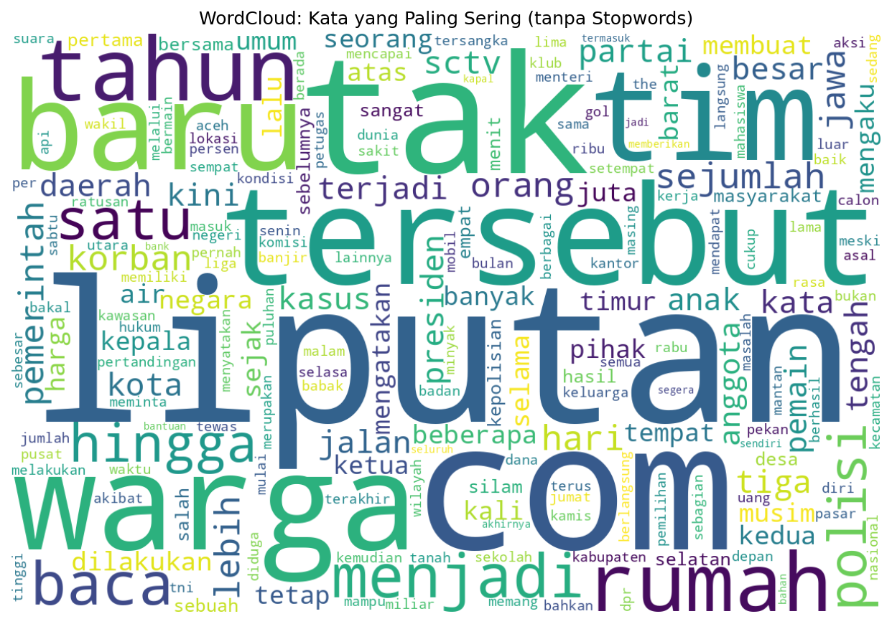

<div align="center">
  
  <h1>🇮🇩 Liputan6 Summarization Project</h1>
  <p><em>Indonesian news summarization with BERT2BERT — Google Colab (T4) optimized</em></p>

  <!-- Badges -->
  <p>
    
    
    
    
    
    
  </p>
  <p>
    <a href="https://github.com/moonandart/AFI_Project2"></a>
  </p>
</div>

---

# 🇮🇩 Liputan6 Summarization Project — IndoBERT2BERT Fine-tuning (Google Colab T4)

End-to-end pipeline for Indonesian **news summarization** using the **Liputan6 dataset** and **BERT2BERT model fine-tuning** on Google Colab (T4 GPU).  
This repository consists of **three stages**, each represented by a Google Colab notebook:

1. **Explorative Data Analysis (EDA)**  
2. **Preprocessing & Cleaning**  
3. **Fine-tuning BERT2BERT summarization model**

---

## ⚡ Quick Start (Colab)
> Semua notebook otomatis mount Google Drive & menyimpan hasil ke `/Tugas/Liputan6/Outputs/`.

- **1. EDA** → [](https://colab.research.google.com/github/moonandart/AFI_Project2/blob/main/notebooks/1Liputan6_EDA_Preprocessing_Tugas.ipynb)  
- **2. Preprocessing** → [](https://colab.research.google.com/github/moonandart/AFI_Project2/blob/main/notebooks/2Liputan6_Preprocessing_Tugas_CLEAN.ipynb)  
- **3. Training (20% + ROUGE)** → [](https://colab.research.google.com/github/moonandart/AFI_Project2/blob/main/notebooks/3Liputan6_Summarization_Bert2Bert_TRAIN_20PCT_withROUGE.ipynb)

> Kamu bisa menaruh notebook di folder `notebooks/` seperti struktur di bawah agar tautan tetap valid.

---

## 📂 Repository Structure
```
AFI_Project2/
├── data/
│   ├── liputan6_dataset.csv              # raw dataset
│   └── liputan6_clean_ready.csv          # cleaned dataset after preprocessing
├── notebooks/
│   ├── 1Liputan6_EDA_Preprocessing_Tugas.ipynb
│   ├── 2Liputan6_Preprocessing_Tugas_CLEAN.ipynb
│   ├── 3Liputan6_Summarization_Bert2Bert_TRAIN_20PCT_withROUGE.ipynb
├── Outputs/
│   ├── models/bert2bert_finetuned_20pct/
│   ├── summaries_finetuned_20pct.csv
│   ├── rouge_scores_20pct.json
│   ├── top_words.csv
│   ├── top_words_bar.png
│   └── wordcloud.png
└── README.md
```

---

## 🧠 1️⃣ Explorative Data Analysis (EDA)
**File:** `notebooks/1Liputan6_EDA_Preprocessing_Tugas.ipynb`  
[](https://colab.research.google.com/github/moonandart/AFI_Project2/blob/main/notebooks/1Liputan6_EDA_Preprocessing_Tugas.ipynb)

### 🔍 Overview
Exploratory Data Analysis untuk memahami struktur, distribusi teks, dan karakteristik dataset Liputan6.  
Termasuk:
- Statistik dataset & missing values  
- Distribusi panjang teks  
- **Frekuensi kata paling umum** dan **WordCloud visualisasi**  
- Simpan hasil ke Google Drive folder `Outputs`

### 📊 Outputs
- `hist_text_length.png` — distribusi panjang teks  
- `top_words_bar.png` — 20 kata paling sering  
- `wordcloud.png` — visualisasi WordCloud  
- `top_words.csv` — daftar kata paling sering  
- `eda_report.txt` — ringkasan hasil analisis  

---

## 🧹 2️⃣ Data Cleaning & Preprocessing
**File:** `notebooks/2Liputan6_Preprocessing_Tugas_CLEAN.ipynb`  
[](https://colab.research.google.com/github/moonandart/AFI_Project2/blob/main/notebooks/2Liputan6_Preprocessing_Tugas_CLEAN.ipynb)

### 🧾 Purpose
Membersihkan dan menyiapkan data untuk pelatihan model summarization.  
Langkah-langkah:
- Mount Google Drive & setup `BASE_DIR`
- Hapus simbol dan whitespace berlebih
- Drop duplikasi dan nilai kosong
- Simpan data bersih ke `/Data/liputan6_clean_ready.csv`

### 🧱 Output Files
- `liputan6_clean_ready.csv` — dataset siap latih  
- `clean_sample.csv` — contoh hasil cleaning  

---

## 🤖 3️⃣ Model Fine-tuning — BERT2BERT Summarization (20% Data + ROUGE)
**File:** `notebooks/3Liputan6_Summarization_Bert2Bert_TRAIN_20PCT_withROUGE.ipynb`  
[](https://colab.research.google.com/github/moonandart/AFI_Project2/blob/main/notebooks/3Liputan6_Summarization_Bert2Bert_TRAIN_20PCT_withROUGE.ipynb)

### 🎯 Objective
Melatih model summarization bahasa Indonesia dengan fine-tuning  
[`cahya/bert2bert-indonesian-summarization`](https://huggingface.co/cahya/bert2bert-indonesian-summarization)  
menggunakan dataset Liputan6 yang telah dibersihkan.

### ⚙️ Configurations
| Parameter | Value | Description |
|------------|--------|-------------|
| `MODEL_NAME` | `cahya/bert2bert-indonesian-summarization` | base model |
| `SAMPLE_FRAC` | `0.2` | hanya gunakan 20% data untuk mempercepat training |
| `NUM_EPOCHS` | `1` | satu epoch saja |
| `TRAIN_BS` | `2` | aman untuk VRAM T4 |
| `fp16` | `True` | mixed precision (optimasi T4) |
| `MAX_INPUT_LEN` | `512` | panjang maksimum input |
| `MAX_TARGET_LEN` | `128` | panjang maksimum ringkasan |

### 🧠 Training Pipeline
- Split data train/validation (95% / 5%)  
- Tokenisasi dengan padding dan truncation  
- Fine-tuning menggunakan `Seq2SeqTrainer`  
- Evaluasi performa dengan metrik **ROUGE**  
- Simpan model fine-tuned ke folder `Outputs/models`

### 📏 ROUGE Example
```json
{{
  "eval_loss": 2.173,
  "eval_rouge1": 0.445,
  "eval_rouge2": 0.172,
  "eval_rougeL": 0.321,
  "eval_rougeLsum": 0.319
}}
```

---

### 📊 Final Evaluation Results (20% Data, 1 Epoch)

| Metric | Score | Interpretation |
|---------|--------|----------------|
| **ROUGE-1** | 🟩 0.5313 | Model memahami konteks dan memilih kata kunci yang relevan |
| **ROUGE-2** | 🟨 0.3877 | Model mampu menangkap pasangan kata penting (2-gram) dengan baik |
| **ROUGE-L** | 🟩 0.4754 | Ringkasan memiliki urutan kalimat yang natural dan koheren |
| **ROUGE-Lsum** | 🟩 0.4756 | Struktur kalimat ringkasan konsisten dengan referensi |

✅ Nilai **ROUGE-1 di atas 0.5** menunjukkan model sudah cukup matang untuk tugas summarization berita Indonesia.  
**ROUGE-L sekitar 0.47** menandakan model menjaga urutan kalimat dan alur ringkasan dengan baik.

---

### 📉 Training & Validation Loss Analysis

| Epoch | Training Loss | Validation Loss | Interpretation |
|--------|----------------|----------------|----------------|
| 1 | 0.2841 | 0.2350 | Kedua loss menurun stabil dan tidak menunjukkan gejala overfitting |

📌 *Karena perbedaan antara Training dan Validation Loss kecil, model dianggap generalisasi dengan baik.*  
Model sudah **konvergen** — menandakan fine-tuning berjalan optimal walaupun hanya dengan **20% data dan 1 epoch**.

---

## ⚡️ GPU Optimization (T4)
Semua notebook telah dioptimasi untuk Google Colab T4 GPU:
```python
fp16 = True
bf16 = False
group_by_length = True
dataloader_num_workers = 2
dataloader_pin_memory = True
save_total_limit = 2
```

| Dataset Fraction | Epochs | Approx. Training Time |
|------------------|--------|------------------------|
| 100% | 1 | ~1 jam |
| 20% (default) | 1 | ✅ ~15 menit |

---

## 🧭 Cara Menjalankan di Colab
1. Jalankan **Notebook 1 (EDA)** → untuk eksplorasi & visualisasi  
2. Jalankan **Notebook 2 (Preprocessing)** → untuk cleaning & simpan dataset  
3. Jalankan **Notebook 3 (Training)** → untuk fine-tuning model & evaluasi ROUGE  

Semua notebook otomatis menyimpan hasil ke:
```
/content/drive/MyDrive/Tugas/Liputan6/Outputs/
```

---

## 🧑‍💻 Author
**Dikembangkan oleh:** Gyeran Huray  
**Tools:** Hugging Face Transformers, PyTorch, ROUGE, Pandas, Matplotlib  
**Environment:** Google Colab (T4 GPU)

---

## 📚 References
- [Cahya Wirawan — IndoBERT2BERT Summarization Model](https://huggingface.co/cahya/bert2bert-indonesian-summarization)  
- [IndoNLG: Indonesian Natural Language Generation Benchmark](https://github.com/IndoNLP/indonlg)  
- [Hugging Face Transformers Documentation](https://huggingface.co/docs)
